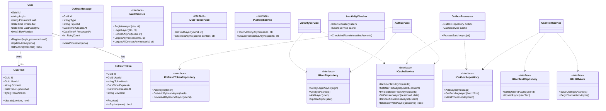

# Диаграмма классов

```mermaid
classDiagram
    direction TB

    class User {
        +Guid Id
        +string Login
        +string PasswordHash
        +DateTime CreatedAt
        +DateTime LastActivityAt
        +byte[] RowVersion
        +Register(login, passwordHash)
        +UpdateActivity(now)
        +IsInactive(threshold) bool
    }

    class UserText {
        +Guid Id
        +Guid UserId
        +string Content
        +DateTime UpdatedAt
        +byte[] RowVersion
        +Update(content, now)
    }

    class RefreshToken {
        +Guid Id
        +Guid UserId
        +string TokenHash
        +DateTime ExpiresAt
        +DateTime CreatedAt
        +string DeviceId
        +Revoke()
        +IsExpired(now) bool
    }

    class OutboxMessage {
        +Guid Id
        +string Type
        +string Payload
        +DateTime CreatedAt
        +DateTime? ProcessedAt
        +int RetryCount
        +MarkProcessed(now)
    }

    class IUserRepository {
        <<interface>>
        +GetByLoginAsync(login)
        +GetByIdAsync(id)
        +AddAsync(user)
        +UpdateAsync(user)
    }

    class IUserTextRepository {
        <<interface>>
        +GetByUserIdAsync(userId)
        +UpsertAsync(userText)
    }

    class IRefreshTokenRepository {
        <<interface>>
        +AddAsync(token)
        +GetValidByHashAsync(hash)
        +RevokeAllByUserIdAsync(userId)
    }

    class IOutboxRepository {
        <<interface>>
        +AddAsync(message)
        +GetPendingAsync(batchSize)
        +MarkProcessedAsync(id)
    }

    class IUnitOfWork {
        <<interface>>
        +SaveChangesAsync(ct)
        +BeginTransactionAsync()
    }

    class ICacheService {
        <<interface>>
        +GetUserTextAsync(userId)
        +SetUserTextAsync(userId, content)
        +InvalidateUserTextAsync(userId)
        +SetSessionAsync(sessionId, data)
        +RevokeAllSessionsAsync(userId)
        +IsSessionValidAsync(sessionId) bool
    }

    class IAuthService {
        <<interface>>
        +RegisterAsync(dto, ct)
        +LoginAsync(dto, ct)
        +RefreshAsync(token, ct)
        +LogoutAsync(sessionId, ct)
        +LogoutAllDevicesAsync(userId, ct)
    }

    class IUserTextService {
        <<interface>>
        +GetTextAsync(userId, ct)
        +SaveTextAsync(userId, content, ct)
    }

    class IActivityService {
        <<interface>>
        +TouchActivityAsync(userId, ct)
        +EnsureNotInactiveAsync(userId, ct)
    }

    class OutboxProcessor {
        -IOutboxRepository outbox
        -ICacheService cache
        +ProcessBatchAsync(ct)
    }

    class InactivityChecker {
        -IUserRepository users
        -ICacheService cache
        +CheckAndRevokeInactiveAsync(ct)
    }

    User "1" --> "0..1" UserText : owns
    User "1" --> "*" RefreshToken : has
    AuthService ..> IUserRepository
    AuthService ..> IRefreshTokenRepository
    AuthService ..> ICacheService
    UserTextService ..> IUserTextRepository
    UserTextService ..> IOutboxRepository
    UserTextService ..> IUnitOfWork
    OutboxProcessor ..> IOutboxRepository
    OutboxProcessor ..> ICacheService
    ActivityService ..> IUserRepository
    ActivityService ..> ICacheService
```
