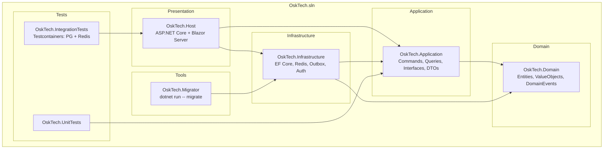

# Структура проектов



## Дерево каталогов

```
OSK_test/
├── OskTech.sln
├── docker-compose.yml
├── Directory.Build.props
├── src/
│   ├── OskTech.Domain/
│   │   └── Entities/
│   ├── OskTech.Application/
│   │   └── Interfaces/
│   ├── OskTech.Infrastructure/
│   │   └── Persistence/
│   ├── OskTech.Host/
│   │   ├── Components/
│   │   ├── Middleware/
│   │   └── Program.cs
│   └── OskTech.Migrator/
│       └── Program.cs
├── tests/
│   ├── OskTech.UnitTests/
│   └── OskTech.IntegrationTests/
└── docs/
    └── diagrams/
```

## Зависимости слоёв

```
Domain ← Application ← Infrastructure ← Host
                              ↑
                         Migrator
```
