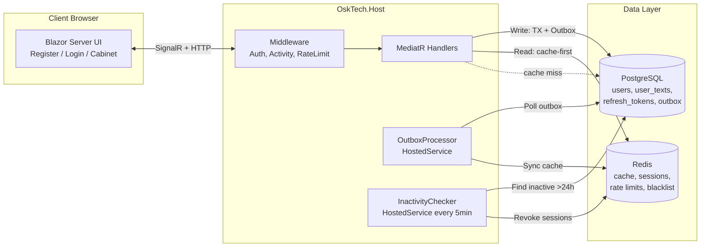

# Архитектура системы

## Потоки данных

| Операция | PostgreSQL | Redis | Outbox |
|----------|------------|-------|--------|
| Register/Login | users, refresh_tokens | session, rate limit | — |
| Get text | user_texts (on miss) | cache:text:{userId} | — |
| Save text | user_texts + outbox row | — (async) | UserTextUpdated |
| Logout all | revoke tokens + outbox | del sessions + blacklist | SessionsRevoked |
| Activity touch | LastActivityAt + outbox | session TTL refresh | ActivityUpdated |

## Outbox

1. В одной транзакции EF Core: UPDATE `user_texts` + INSERT `outbox_messages`.
2. `OutboxProcessorHostedService` читает необработанные записи (`FOR UPDATE SKIP LOCKED`).
3. Пишет в Redis, помечает `ProcessedAt`.
4. При сбое — retry с exponential backoff.

## Нагрузка (10k concurrent)

- Kestrel: `MaxConcurrentConnections = 10000`
- Npgsql pool: `Maximum Pool Size=200`
- Redis: один `IConnectionMultiplexer`
- Rate limit: login/register через Redis sliding window
- `CancellationToken` во всех handler'ах
