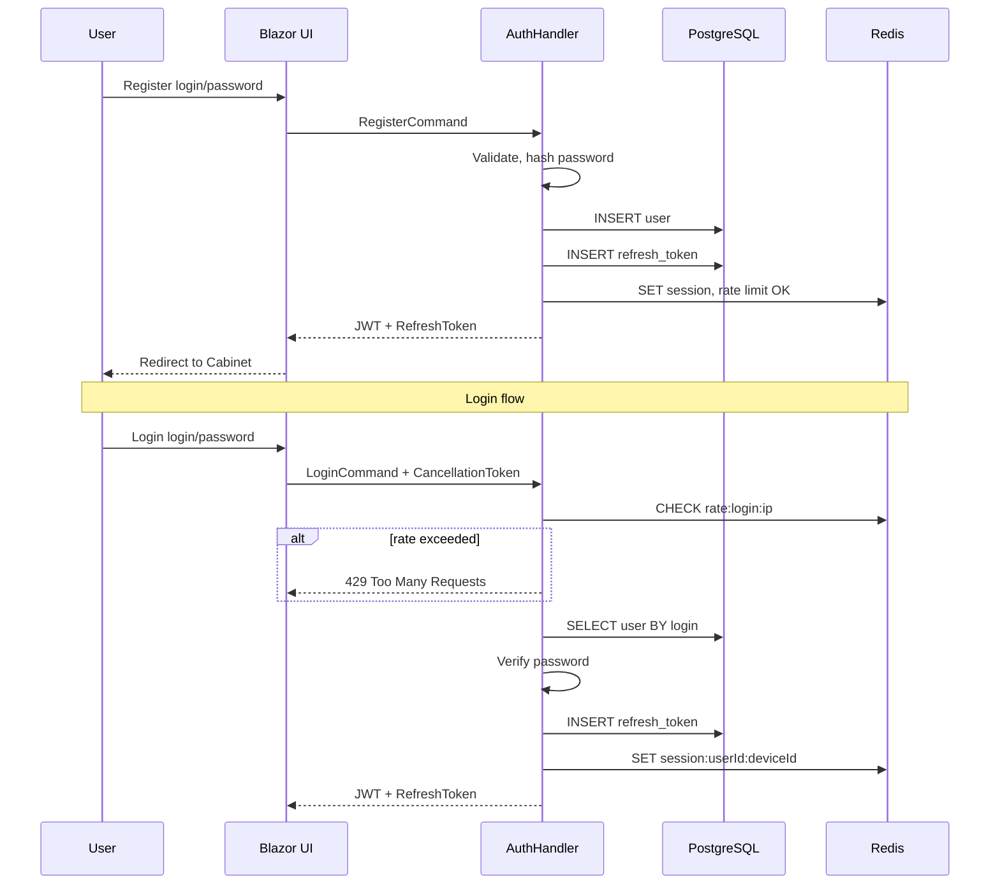
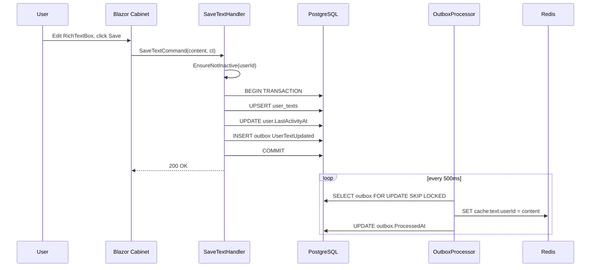
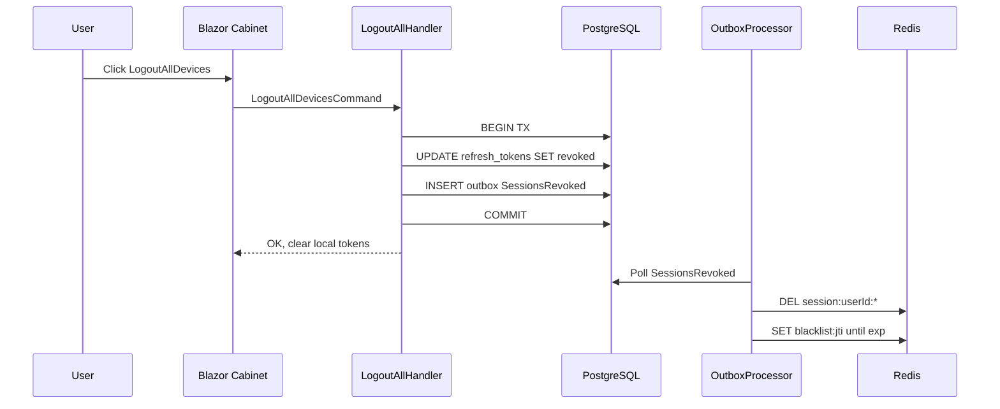
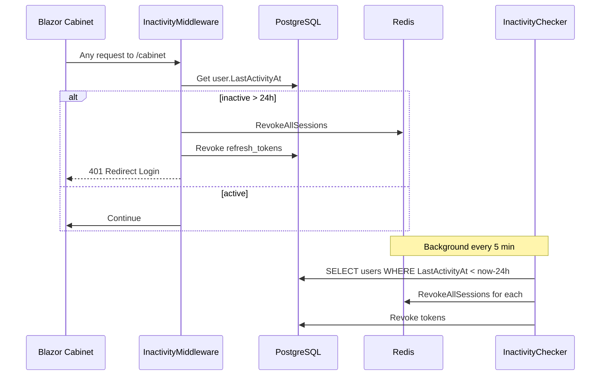

# Диаграммы взаимодействий

## Регистрация и вход

```mermaid
sequenceDiagram
    participant U as User
    participant B as Blazor UI
    participant A as AuthHandler
    participant DB as PostgreSQL
    participant R as Redis

    U->>B: Register login/password
    B->>A: RegisterCommand
    A->>A: Validate, hash password
    A->>DB: INSERT user
    A->>DB: INSERT refresh_token
    A->>R: SET session, rate limit OK
    A-->>B: JWT + RefreshToken
    B-->>U: Redirect to Cabinet

    Note over U,R: Login flow
    U->>B: Login login/password
    B->>A: LoginCommand + CancellationToken
    A->>R: CHECK rate:login:ip
    alt rate exceeded
        A-->>B: 429 Too Many Requests
    end
    A->>DB: SELECT user BY login
    A->>A: Verify password
    A->>DB: INSERT refresh_token
    A->>R: SET session:userId:deviceId
    A-->>B: JWT + RefreshToken
```

## Сохранение текста (Outbox → Redis)

```mermaid
sequenceDiagram
    participant U as User
    participant B as Blazor Cabinet
    participant T as SaveTextHandler
    participant DB as PostgreSQL
    participant O as OutboxProcessor
    participant R as Redis

    U->>B: Edit RichTextBox, click Save
    B->>T: SaveTextCommand(content, ct)
    T->>T: EnsureNotInactive(userId)
    T->>DB: BEGIN TRANSACTION
    T->>DB: UPSERT user_texts
    T->>DB: UPDATE user.LastActivityAt
    T->>DB: INSERT outbox UserTextUpdated
    T->>DB: COMMIT
    T-->>B: 200 OK

    loop every 500ms
        O->>DB: SELECT outbox FOR UPDATE SKIP LOCKED
        O->>R: SET cache:text:userId = content
        O->>DB: UPDATE outbox.ProcessedAt
    end
```

## Выход со всех устройств

```mermaid
sequenceDiagram
    participant U as User
    participant B as Blazor Cabinet
    participant L as LogoutAllHandler
    participant DB as PostgreSQL
    participant O as OutboxProcessor
    participant R as Redis

    U->>B: Click LogoutAllDevices
    B->>L: LogoutAllDevicesCommand
    L->>DB: BEGIN TX
    L->>DB: UPDATE refresh_tokens SET revoked
    L->>DB: INSERT outbox SessionsRevoked
    L->>DB: COMMIT
    L-->>B: OK, clear local tokens

    O->>DB: Poll SessionsRevoked
    O->>R: DEL session:userId:*
    O->>R: SET blacklist:jti until exp
```

## Авто-выход по неактивности (>24ч)

```mermaid
sequenceDiagram
    participant B as Blazor Cabinet
    participant M as InactivityMiddleware
    participant DB as PostgreSQL
    participant R as Redis
    participant BG as InactivityChecker

    B->>M: Any request to /cabinet
    M->>DB: Get user.LastActivityAt
    alt inactive > 24h
        M->>R: RevokeAllSessions
        M->>DB: Revoke refresh_tokens
        M-->>B: 401 Redirect Login
    else active
        M->>B: Continue
    end

    Note over BG,R: Background every 5 min
    BG->>DB: SELECT users WHERE LastActivityAt < now-24h
    BG->>R: RevokeAllSessions for each
    BG->>DB: Revoke tokens
```
